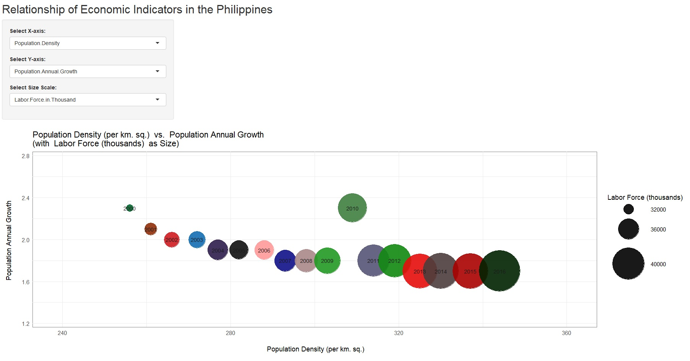

Developing Data Products: Week 04 Assignment
========================================================
author: Grejell B. Segura
date: January 03, 2018
autosize: true

Overview
========================================================

This application allows the user to compare some economic indicators of the Philippines. The data was taken from https://www.pids.gov.ph ranging from year 2000 - 2016. The output shows a scatter plot per year where a 3rd dimension shows the size scale for the selected variable.

- The application allows the user to pick 3 economic indicators.
- The first input is for the X-axis, default value is Population Density.
- The second iput is for the Y-axis, default value is Population Annual Growth
- The 3rd input is the size scale, default value is Labor Force.

Here is the link for the app:
https://grejsegura.shinyapps.io/CourseraShinyApp/


Economic Indicators
========================================================
autosize: true
The following are the economic indicators included in the application.


```
 [1] "Population"                                  
 [2] "Population.Density"                          
 [3] "Population.Annual.Growth"                    
 [4] "Urban.Population.Percent.of.Total.Population"
 [5] "Labor.Force.in.Thousand"                     
 [6] "Employed"                                    
 [7] "Unemployed"                                  
 [8] "Unemployment.Rate"                           
 [9] "Labor.Force.Participation.Rate"              
[10] "GDP"                                         
[11] "Net.Factor.Income.from.Abroad"               
[12] "GNI"                                         
```

Economic Indicators Summary
========================================================
autosize: true
A summary of 3 of the most significant and common indicator.

```r
summary(data[, c(3,8,10)])
```

```
   Population        Employed     Unemployment.Rate
 Min.   : 76.80   Min.   :27453   Min.   : 5.400   
 1st Qu.: 83.10   1st Qu.:31613   1st Qu.: 7.000   
 Median : 89.40   Median :34089   Median : 7.400   
 Mean   : 89.78   Mean   :34361   Mean   : 8.347   
 3rd Qu.: 96.50   3rd Qu.:37600   3rd Qu.:11.100   
 Max.   :103.20   Max.   :40998   Max.   :11.800   
```

Interface
========================================================
Below is the application's interface.

