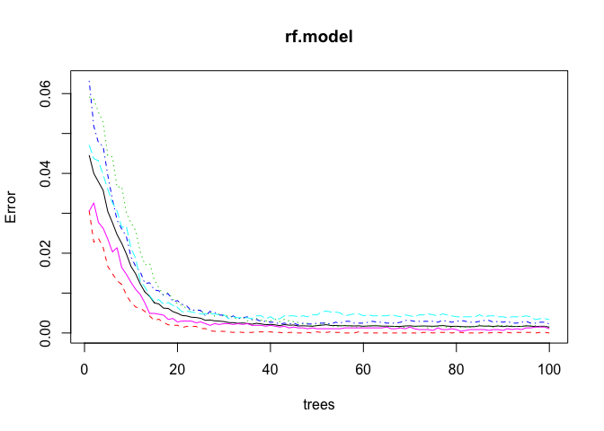

Human Activity Recognition
==========================

Overview
--------

This report walkthroughs a classification problem using the Weight
Lifting Exercise Dataset. The goal of this project is to build a machine
learning algorithm that predicts the manner of exercise which the user
is performing. This will also serve as a walkthrough to how the model
was built from raw data extraction to model building. A testing data set
was given with 20 observation and will be used to conduct a prediction
test at the end of this report. From the data source, it says:

"Six young health participants were asked to perform one set of 10
repetitions of the Unilateral Dumbbell Biceps Curl in five different
fashions: exactly according to the specification (Class A), throwing the
elbows to the front (Class B), lifting the dumbbell only halfway (Class
C), lowering the dumbbell only halfway (Class D) and throwing the hips
to the front (Class E)."

### Loading the data and libraries

    library(caret)
    library(randomForest)
    library(RCurl)
    library(lubridate)
    set.seed(321)

    url.train <- getURL("https://d396qusza40orc.cloudfront.net/predmachlearn/pml-training.csv")
    url.test <- getURL("https://d396qusza40orc.cloudfront.net/predmachlearn/pml-testing.csv")

    data.train <- read.csv(text = url.train) ## training data set
    data.test <- read.csv(text = url.test) ## testing data set
    dim(data.train)

    ## [1] 19622   160

    dim(data.test)

    ## [1]  20 160

data.train has 19,622 observations and 160 variables. Moreover, like I
said, the testing data set has 20 observations.

### Data Preprocessing

Let us check first if there are NAs or missing values in the data.

    any(is.na(data.train))  ## checking if NAs exist

    ## [1] TRUE

The result for the command summary(data.train) was not shown here as it
has a lot of information given the 160 features. Nevertheless, it was
studied and the observations were noted and considered.

There are a number of unwanted and missing values upon checking the
summary. It can be observed that the data has NAs, blanks and even the
string "\#DIV/0!" which is basically an error message when you calculate
something in MS excel. These has to be either replaced or removed. I set
the allowed number of missing values to be less than 20% of the
observations for every features and try the imputation of this missing
values if applicable. Those which has more than 20% of missing values
will automatically be removed.

    naColumns <- colSums(is.na(data.train) | data.train =="" | data.train == "#DIV/0!")/nrow(data.train)
    naColumns <- ifelse(naColumns > 0.2, FALSE, TRUE)

    data.train <- data.train[, naColumns] ## remove the columns with more than 20% missing values
    data.test <- data.test[, naColumns] ## applying the same to testing data
    any(is.na(data.train))  ## checking if NAs exist

    ## [1] FALSE

    any(data.train == "")  ## checking for blanks

    ## [1] FALSE

    any(data.train == "#DIV/0!") ## checking for error string

    ## [1] FALSE

The data has no more NAs and missing values. Imputation is not needed
then. Let us proceed on checking the summary for the remaining features.

    summary(data.train)

    ##        X            user_name    raw_timestamp_part_1 raw_timestamp_part_2
    ##  Min.   :    1   adelmo  :3892   Min.   :1.322e+09    Min.   :   294      
    ##  1st Qu.: 4906   carlitos:3112   1st Qu.:1.323e+09    1st Qu.:252912      
    ##  Median : 9812   charles :3536   Median :1.323e+09    Median :496380      
    ##  Mean   : 9812   eurico  :3070   Mean   :1.323e+09    Mean   :500656      
    ##  3rd Qu.:14717   jeremy  :3402   3rd Qu.:1.323e+09    3rd Qu.:751891      
    ##  Max.   :19622   pedro   :2610   Max.   :1.323e+09    Max.   :998801      
    ##                                                                           
    ##           cvtd_timestamp  new_window    num_window      roll_belt     
    ##  28/11/2011 14:14: 1498   no :19216   Min.   :  1.0   Min.   :-28.90  
    ##  05/12/2011 11:24: 1497   yes:  406   1st Qu.:222.0   1st Qu.:  1.10  
    ##  30/11/2011 17:11: 1440               Median :424.0   Median :113.00  
    ##  05/12/2011 11:25: 1425               Mean   :430.6   Mean   : 64.41  
    ##  02/12/2011 14:57: 1380               3rd Qu.:644.0   3rd Qu.:123.00  
    ##  02/12/2011 13:34: 1375               Max.   :864.0   Max.   :162.00  
    ##  (Other)         :11007                                               
    ##    pitch_belt          yaw_belt       total_accel_belt  gyros_belt_x      
    ##  Min.   :-55.8000   Min.   :-180.00   Min.   : 0.00    Min.   :-1.040000  
    ##  1st Qu.:  1.7600   1st Qu.: -88.30   1st Qu.: 3.00    1st Qu.:-0.030000  
    ##  Median :  5.2800   Median : -13.00   Median :17.00    Median : 0.030000  
    ##  Mean   :  0.3053   Mean   : -11.21   Mean   :11.31    Mean   :-0.005592  
    ##  3rd Qu.: 14.9000   3rd Qu.:  12.90   3rd Qu.:18.00    3rd Qu.: 0.110000  
    ##  Max.   : 60.3000   Max.   : 179.00   Max.   :29.00    Max.   : 2.220000  
    ##                                                                           
    ##   gyros_belt_y       gyros_belt_z      accel_belt_x       accel_belt_y   
    ##  Min.   :-0.64000   Min.   :-1.4600   Min.   :-120.000   Min.   :-69.00  
    ##  1st Qu.: 0.00000   1st Qu.:-0.2000   1st Qu.: -21.000   1st Qu.:  3.00  
    ##  Median : 0.02000   Median :-0.1000   Median : -15.000   Median : 35.00  
    ##  Mean   : 0.03959   Mean   :-0.1305   Mean   :  -5.595   Mean   : 30.15  
    ##  3rd Qu.: 0.11000   3rd Qu.:-0.0200   3rd Qu.:  -5.000   3rd Qu.: 61.00  
    ##  Max.   : 0.64000   Max.   : 1.6200   Max.   :  85.000   Max.   :164.00  
    ##                                                                          
    ##   accel_belt_z     magnet_belt_x   magnet_belt_y   magnet_belt_z   
    ##  Min.   :-275.00   Min.   :-52.0   Min.   :354.0   Min.   :-623.0  
    ##  1st Qu.:-162.00   1st Qu.:  9.0   1st Qu.:581.0   1st Qu.:-375.0  
    ##  Median :-152.00   Median : 35.0   Median :601.0   Median :-320.0  
    ##  Mean   : -72.59   Mean   : 55.6   Mean   :593.7   Mean   :-345.5  
    ##  3rd Qu.:  27.00   3rd Qu.: 59.0   3rd Qu.:610.0   3rd Qu.:-306.0  
    ##  Max.   : 105.00   Max.   :485.0   Max.   :673.0   Max.   : 293.0  
    ##                                                                    
    ##     roll_arm         pitch_arm          yaw_arm          total_accel_arm
    ##  Min.   :-180.00   Min.   :-88.800   Min.   :-180.0000   Min.   : 1.00  
    ##  1st Qu.: -31.77   1st Qu.:-25.900   1st Qu.: -43.1000   1st Qu.:17.00  
    ##  Median :   0.00   Median :  0.000   Median :   0.0000   Median :27.00  
    ##  Mean   :  17.83   Mean   : -4.612   Mean   :  -0.6188   Mean   :25.51  
    ##  3rd Qu.:  77.30   3rd Qu.: 11.200   3rd Qu.:  45.8750   3rd Qu.:33.00  
    ##  Max.   : 180.00   Max.   : 88.500   Max.   : 180.0000   Max.   :66.00  
    ##                                                                         
    ##   gyros_arm_x        gyros_arm_y       gyros_arm_z       accel_arm_x     
    ##  Min.   :-6.37000   Min.   :-3.4400   Min.   :-2.3300   Min.   :-404.00  
    ##  1st Qu.:-1.33000   1st Qu.:-0.8000   1st Qu.:-0.0700   1st Qu.:-242.00  
    ##  Median : 0.08000   Median :-0.2400   Median : 0.2300   Median : -44.00  
    ##  Mean   : 0.04277   Mean   :-0.2571   Mean   : 0.2695   Mean   : -60.24  
    ##  3rd Qu.: 1.57000   3rd Qu.: 0.1400   3rd Qu.: 0.7200   3rd Qu.:  84.00  
    ##  Max.   : 4.87000   Max.   : 2.8400   Max.   : 3.0200   Max.   : 437.00  
    ##                                                                          
    ##   accel_arm_y      accel_arm_z       magnet_arm_x     magnet_arm_y   
    ##  Min.   :-318.0   Min.   :-636.00   Min.   :-584.0   Min.   :-392.0  
    ##  1st Qu.: -54.0   1st Qu.:-143.00   1st Qu.:-300.0   1st Qu.:  -9.0  
    ##  Median :  14.0   Median : -47.00   Median : 289.0   Median : 202.0  
    ##  Mean   :  32.6   Mean   : -71.25   Mean   : 191.7   Mean   : 156.6  
    ##  3rd Qu.: 139.0   3rd Qu.:  23.00   3rd Qu.: 637.0   3rd Qu.: 323.0  
    ##  Max.   : 308.0   Max.   : 292.00   Max.   : 782.0   Max.   : 583.0  
    ##                                                                      
    ##   magnet_arm_z    roll_dumbbell     pitch_dumbbell     yaw_dumbbell     
    ##  Min.   :-597.0   Min.   :-153.71   Min.   :-149.59   Min.   :-150.871  
    ##  1st Qu.: 131.2   1st Qu.: -18.49   1st Qu.: -40.89   1st Qu.: -77.644  
    ##  Median : 444.0   Median :  48.17   Median : -20.96   Median :  -3.324  
    ##  Mean   : 306.5   Mean   :  23.84   Mean   : -10.78   Mean   :   1.674  
    ##  3rd Qu.: 545.0   3rd Qu.:  67.61   3rd Qu.:  17.50   3rd Qu.:  79.643  
    ##  Max.   : 694.0   Max.   : 153.55   Max.   : 149.40   Max.   : 154.952  
    ##                                                                         
    ##  total_accel_dumbbell gyros_dumbbell_x    gyros_dumbbell_y  
    ##  Min.   : 0.00        Min.   :-204.0000   Min.   :-2.10000  
    ##  1st Qu.: 4.00        1st Qu.:  -0.0300   1st Qu.:-0.14000  
    ##  Median :10.00        Median :   0.1300   Median : 0.03000  
    ##  Mean   :13.72        Mean   :   0.1611   Mean   : 0.04606  
    ##  3rd Qu.:19.00        3rd Qu.:   0.3500   3rd Qu.: 0.21000  
    ##  Max.   :58.00        Max.   :   2.2200   Max.   :52.00000  
    ##                                                             
    ##  gyros_dumbbell_z  accel_dumbbell_x  accel_dumbbell_y  accel_dumbbell_z 
    ##  Min.   : -2.380   Min.   :-419.00   Min.   :-189.00   Min.   :-334.00  
    ##  1st Qu.: -0.310   1st Qu.: -50.00   1st Qu.:  -8.00   1st Qu.:-142.00  
    ##  Median : -0.130   Median :  -8.00   Median :  41.50   Median :  -1.00  
    ##  Mean   : -0.129   Mean   : -28.62   Mean   :  52.63   Mean   : -38.32  
    ##  3rd Qu.:  0.030   3rd Qu.:  11.00   3rd Qu.: 111.00   3rd Qu.:  38.00  
    ##  Max.   :317.000   Max.   : 235.00   Max.   : 315.00   Max.   : 318.00  
    ##                                                                         
    ##  magnet_dumbbell_x magnet_dumbbell_y magnet_dumbbell_z  roll_forearm      
    ##  Min.   :-643.0    Min.   :-3600     Min.   :-262.00   Min.   :-180.0000  
    ##  1st Qu.:-535.0    1st Qu.:  231     1st Qu.: -45.00   1st Qu.:  -0.7375  
    ##  Median :-479.0    Median :  311     Median :  13.00   Median :  21.7000  
    ##  Mean   :-328.5    Mean   :  221     Mean   :  46.05   Mean   :  33.8265  
    ##  3rd Qu.:-304.0    3rd Qu.:  390     3rd Qu.:  95.00   3rd Qu.: 140.0000  
    ##  Max.   : 592.0    Max.   :  633     Max.   : 452.00   Max.   : 180.0000  
    ##                                                                           
    ##  pitch_forearm     yaw_forearm      total_accel_forearm gyros_forearm_x  
    ##  Min.   :-72.50   Min.   :-180.00   Min.   :  0.00      Min.   :-22.000  
    ##  1st Qu.:  0.00   1st Qu.: -68.60   1st Qu.: 29.00      1st Qu.: -0.220  
    ##  Median :  9.24   Median :   0.00   Median : 36.00      Median :  0.050  
    ##  Mean   : 10.71   Mean   :  19.21   Mean   : 34.72      Mean   :  0.158  
    ##  3rd Qu.: 28.40   3rd Qu.: 110.00   3rd Qu.: 41.00      3rd Qu.:  0.560  
    ##  Max.   : 89.80   Max.   : 180.00   Max.   :108.00      Max.   :  3.970  
    ##                                                                          
    ##  gyros_forearm_y     gyros_forearm_z    accel_forearm_x   accel_forearm_y 
    ##  Min.   : -7.02000   Min.   : -8.0900   Min.   :-498.00   Min.   :-632.0  
    ##  1st Qu.: -1.46000   1st Qu.: -0.1800   1st Qu.:-178.00   1st Qu.:  57.0  
    ##  Median :  0.03000   Median :  0.0800   Median : -57.00   Median : 201.0  
    ##  Mean   :  0.07517   Mean   :  0.1512   Mean   : -61.65   Mean   : 163.7  
    ##  3rd Qu.:  1.62000   3rd Qu.:  0.4900   3rd Qu.:  76.00   3rd Qu.: 312.0  
    ##  Max.   :311.00000   Max.   :231.0000   Max.   : 477.00   Max.   : 923.0  
    ##                                                                           
    ##  accel_forearm_z   magnet_forearm_x  magnet_forearm_y magnet_forearm_z
    ##  Min.   :-446.00   Min.   :-1280.0   Min.   :-896.0   Min.   :-973.0  
    ##  1st Qu.:-182.00   1st Qu.: -616.0   1st Qu.:   2.0   1st Qu.: 191.0  
    ##  Median : -39.00   Median : -378.0   Median : 591.0   Median : 511.0  
    ##  Mean   : -55.29   Mean   : -312.6   Mean   : 380.1   Mean   : 393.6  
    ##  3rd Qu.:  26.00   3rd Qu.:  -73.0   3rd Qu.: 737.0   3rd Qu.: 653.0  
    ##  Max.   : 291.00   Max.   :  672.0   Max.   :1480.0   Max.   :1090.0  
    ##                                                                       
    ##  classe  
    ##  A:5580  
    ##  B:3797  
    ##  C:3422  
    ##  D:3216  
    ##  E:3607  
    ##          
    ## 

There are features that are NOT needed here. Upon examining, X has to be
removed as it is only an index of the observation. user\_name should be
removed as well along with the timestamps as it give any useful
information.

    data.train <- data.train[, -c(1, 2, 3, 4, 5, 6, 7)]
    data.test <- data.test[, -c(1, 2, 3, 4, 5, 6, 7)] ## applying the same to the testing data

We now have a clean data that has 53 features.

### Model Building

Let us create a data partition for training and testing. 65% of the data
was used for training while the rest was alloted for out-of-sample
testing.

    index <- createDataPartition(data.train$classe, 2, p = 0.65, list = FALSE)
    train <- data.train[index, ]
    test <- data.train[-index, ]

The algorithm of choice is the random forest which is a very powerful
machine learning method. The package "randomForest" was used for this.

Since randomForest, for some reason needed to have the formula written
on the model training function, we need to create a formula to address
this.

    names <- names(train)[1:(length(train)-1)]
    names.paste <- paste("classe", paste(names, collapse = "+"), sep = "~")

Now, we train the model by using all the default parameters in the
function randomForest. The number of trees grown is 100 to minimize the
time consumption on the training while the default number of features
per tree is square root of the total number of features. The argument
"importance" was also set to TRUE to check the relative importance of
the features later on.

    rf.model <- randomForest(as.formula(names.paste), train, importance = TRUE, ntree = 100)
    min(rf.model$err.rate)

    ## [1] 0

The error rate for the in-sample-test was 0. This is pretty remarkable.

Let us proceed on testing the model to the alloted test data and see if
the model over-fitted.

    pred.rf <- predict(rf.model, test)
    confusionMatrix(pred.rf, test[, "classe"])

    ## Confusion Matrix and Statistics
    ## 
    ##           Reference
    ## Prediction   A   B   C   D   E
    ##          A 678   2   0   0   0
    ##          B   3 420   1   0   0
    ##          C   0   0 431   2   0
    ##          D   0   0   0 389   0
    ##          E   0   0   0   0 435
    ## 
    ## Overall Statistics
    ##                                           
    ##                Accuracy : 0.9966          
    ##                  95% CI : (0.9933, 0.9985)
    ##     No Information Rate : 0.2884          
    ##     P-Value [Acc > NIR] : < 2.2e-16       
    ##                                           
    ##                   Kappa : 0.9957          
    ##  Mcnemar's Test P-Value : NA              
    ## 
    ## Statistics by Class:
    ## 
    ##                      Class: A Class: B Class: C Class: D Class: E
    ## Sensitivity            0.9956   0.9953   0.9977   0.9949   1.0000
    ## Specificity            0.9988   0.9979   0.9990   1.0000   1.0000
    ## Pos Pred Value         0.9971   0.9906   0.9954   1.0000   1.0000
    ## Neg Pred Value         0.9982   0.9990   0.9995   0.9990   1.0000
    ## Prevalence             0.2884   0.1787   0.1830   0.1656   0.1842
    ## Detection Rate         0.2872   0.1779   0.1825   0.1648   0.1842
    ## Detection Prevalence   0.2880   0.1796   0.1834   0.1648   0.1842
    ## Balanced Accuracy      0.9972   0.9966   0.9983   0.9974   1.0000

Amazingly, the model has correctly predicted all but 8 of the
observations. That is at 99.66% accuracy.

Let us check the plot.

    plot(rf.model)

The plot basically tells that the out-of-bag error converged before the
100th tree.

Let us also check the variable importance to see which feature is
relatively more important than the others.

    imp <- as.data.frame(rf.model$importance)
    row.names(imp)[which(imp$MeanDecreaseGini == max(imp$MeanDecreaseGini))]

    ## [1] "roll_belt"

The result show that roll\_belt is the most important among the
features.

### Predicting the Test Data

There are 20 observations given for the testing data. It has been
cleaned up to replicate the number of features in the training set.

    pred.rf.testing <- predict(rf.model, data.test)
    pred.rf.testing

    ##  1  2  3  4  5  6  7  8  9 10 11 12 13 14 15 16 17 18 19 20 
    ##  B  A  B  A  A  E  D  B  A  A  B  C  B  A  E  E  A  B  B  B 
    ## Levels: A B C D E

Conclusion
----------

The model build was based on the random forest algorithm. It has an
amazing 99.66% accuracy on the out-of-sample testing data which is very
impressive.
